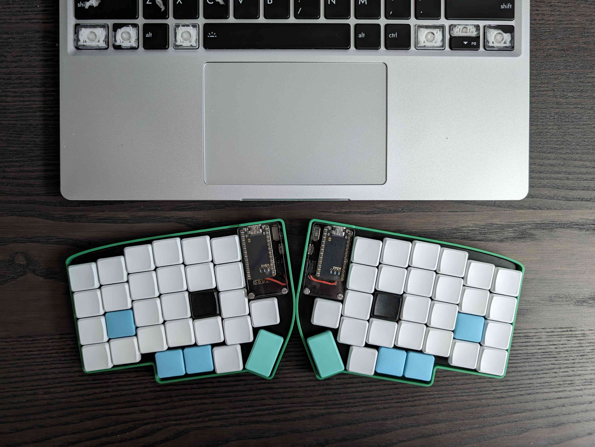

# Lily58

This is my configuration and notes for my Lily58 bought from https://typeractive.xyz/ (highly recommended!)



## Setup

### Build locally

Install ZMK toolchain:
https://zmk.dev/docs/development/setup

Build the config from the ZMK folder (make sure to clean the `build/` folder before each build):

Left side:

```sh
west build -s app/ -d build/ -b "nice_nano_v2"  -- -DZMK_CONFIG=/home/mwu/Documents/git-repos/lily58-wireless-zmk-config/config/ -DSHIELD="lily58_left"
cp build/zephyr/zmk.uf2 ../lily58-wireless-zmk-config/build/lily58_left-nice_nano_v2-zmk.uf2
```

Right side:

```sh
west build -s app/ -d build/ -b "nice_nano_v2"  -- -DZMK_CONFIG=/home/mwu/Documents/git-repos/lily58-wireless-zmk-config/config/ -DSHIELD="lily58_right"
cp build/zephyr/zmk.uf2 ../lily58-wireless-zmk-config/build/lily58_right-nice_nano_v2-zmk.uf2
```

### Update keyboard sides

1. For each side, connect via USB and copy the respective `.uf2` file.
2. It will then update/restart and disconnect from USB with an "Error while copying" (false error).

Note: sometimes Nautilus won't allow writing apparently after reconnecting or connecting the other side after, I think because it wasn't properly ejected. So just eject and reconnect, and writing will work again.

## Get peripheral battery level

Ensure these are set in the config:

```text
CONFIG_ZMK_SPLIT_BLE_CENTRAL_BATTERY_LEVEL_FETCHING=y
CONFIG_ZMK_SPLIT_BLE_CENTRAL_BATTERY_LEVEL_PROXY=y
```

https://github.com/zmkfirmware/zmk/pull/2045#issue-2017569922

> Confirmed that using bluetoothctl I can subscribe to notifications on the other Battery Level service on a split central, and properly receive notifications it has "proxied" from the split peripheral.

```sh
$ bluetoothctl
```

If not already connected to the Lily58, list with `devices` and connect to it with `connect XX:XX:XX:XX:XX:XX`.

Then find the general attribute for `Battery Level`:

```text
[Lily58]# menu gatt
[Lily58]# list-attributes
```

Find the primary and secondary `Battery Service` with its `Battery Level` characteristic sections. After enabling peripheral battery level, there will be two of them instead of one.

```text
Primary Service (Handle 0x0000)
	/org/bluez/hci0/dev_FC_A3_7B_3A_27_4F/service0010
	0000180f-0000-1000-8000-00805f9b34fb
	Battery Service
Characteristic (Handle 0x0000)
	/org/bluez/hci0/dev_FC_A3_7B_3A_27_4F/service0010/char0011
	00002a19-0000-1000-8000-00805f9b34fb
	Battery Level
...
Secondary Service (Handle 0x0000)
	/org/bluez/hci0/dev_FC_A3_7B_3A_27_4F/service0015
	0000180f-0000-1000-8000-00805f9b34fb
	Battery Service
Characteristic (Handle 0x0000)
	/org/bluez/hci0/dev_FC_A3_7B_3A_27_4F/service0015/char0016
	00002a19-0000-1000-8000-00805f9b34fb
	Battery Level
```

Since the UUIDs are identical, we `select-attribute` using the service value instead.

The `Battery Level` characteristic under `Primary Service` is for the main (left) side, shown in hexadecimal:

```text
[Lily58]# select-attribute /org/bluez/hci0/dev_FC_A3_7B_3A_27_4F/service0010/char0011

[Lily58:/service0010/char0011]# attribute-info
Characteristic - Battery Level
	UUID: 00002a19-0000-1000-8000-00805f9b34fb
	Service: /org/bluez/hci0/dev_FC_A3_7B_3A_27_4F/service0010
	Value:
  5a                                               Z
	Notifying: no
	Flags: read
	Flags: notify
	MTU: 0x0041 (65)

[Lily58:/service0010/char0011]# read
Attempting to read /org/bluez/hci0/dev_FC_A3_7B_3A_27_4F/service0010/char0011
[Lily58:/service0010/char0011]# [CHG] Attribute /org/bluez/hci0/dev_FC_A3_7B_3A_27_4F/service0010/char0011 Value:
[Lily58:/service0010/char0011]#   5b                                               [
[Lily58:/service0010/char0011]#   5b                                               [
[Lily58:/service0010/char0011]#
```

While under `Secondary Service` is for the secondary/peripheral (right) side, shown in hexadecimal:

```text
[Lily58]# select-attribute /org/bluez/hci0/dev_FC_A3_7B_3A_27_4F/service0015/char0016

[Lily58:/service0015/char0016]# attribute-info
Characteristic - Battery Level
	UUID: 00002a19-0000-1000-8000-00805f9b34fb
	Service: /org/bluez/hci0/dev_FC_A3_7B_3A_27_4F/service0015
	Value:
  54                                               T
	Notifying: no
	Flags: read
	Flags: notify
	MTU: 0x0041 (65)

[Lily58:/service0015/char0016]# read
Attempting to read /org/bluez/hci0/dev_FC_A3_7B_3A_27_4F/service0015/char0016
[Lily58:/service0015/char0016]# [CHG] Attribute /org/bluez/hci0/dev_FC_A3_7B_3A_27_4F/service0015/char0016 Value:
[Lily58:/service0015/char0016]#   54                                               T
[Lily58:/service0015/char0016]#   54                                               T
```

To turn notify on:

```
[Lily58:/service..../char....]# notify on
```
